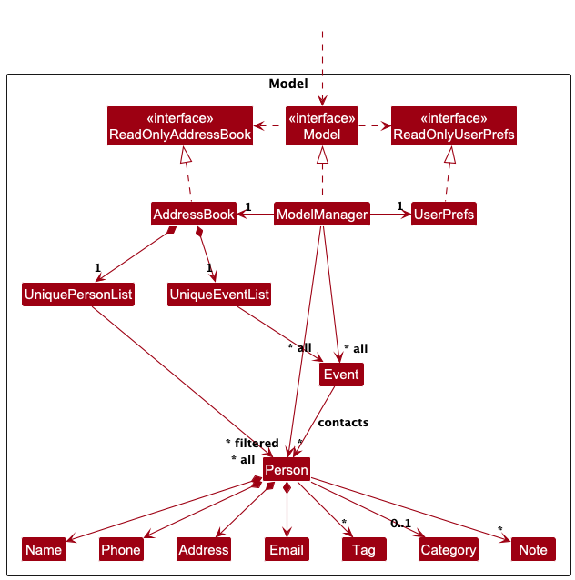
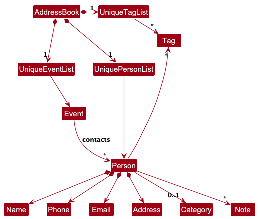

* Table of Contents
{:toc}

--------------------------------------------------------------------------------------------------------------------

## **Acknowledgements**

* {list here sources of all reused/adapted ideas, code, documentation, and third-party libraries -- include links to the original source as well}

--------------------------------------------------------------------------------------------------------------------

## **Setting up, getting started**

Refer to the guide [_Setting up and getting started_](SettingUp.md).

--------------------------------------------------------------------------------------------------------------------

## **Design**

:bulb: **Tip:** The `.puml` files used to create diagrams in this document `docs/diagrams` folder. Refer to the [_PlantUML Tutorial_ at se-edu/guides](https://se-education.org/guides/tutorials/plantUml.html) to learn how to create and edit diagrams.

### Architecture

The ***Architecture Diagram*** given above explains the high-level design of the App.

Given below is a quick overview of main components and how they interact with each other.

**Main components of the architecture**

**`Main`** (consisting of classes [`Main`](https://github.com/se-edu/addressbook-level3/tree/master/src/main/java/seedu/address/Main.java) and [`MainApp`](https://github.com/se-edu/addressbook-level3/tree/master/src/main/java/seedu/address/MainApp.java)) is in charge of the app launch and shut down.
* At app launch, it initializes the other components in the correct sequence, and connects them up with each other.
* At shut down, it shuts down the other components and invokes cleanup methods where necessary.

The bulk of the app's work is done by the following four components:

* [**`UI`**](#ui-component): The UI of the App.
* [**`Logic`**](#logic-component): The command executor.
* [**`Model`**](#model-component): Holds the data of the App in memory.
* [**`Storage`**](#storage-component): Reads data from, and writes data to, the hard disk.

[**`Commons`**](#common-classes) represents a collection of classes used by multiple other components.

**How the architecture components interact with each other**

The *Sequence Diagram* below shows how the components interact with each other for the scenario where the user issues the command `delete 1`.

Each of the four main components (also shown in the diagram above),

* defines its *API* in an `interface` with the same name as the Component.
* implements its functionality using a concrete `{Component Name}Manager` class (which follows the corresponding API `interface` mentioned in the previous point.

For example, the `Logic` component defines its API in the `Logic.java` interface and implements its functionality using the `LogicManager.java` class which follows the `Logic` interface. Other components interact with a given component through its interface rather than the concrete class (reason: to prevent outside component's being coupled to the implementation of a component), as illustrated in the (partial) class diagram below.

The sections below give more details of each component.

### UI component

The **API** of this component is specified in [`Ui.java`](https://github.com/se-edu/addressbook-level3/tree/master/src/main/java/seedu/address/ui/Ui.java)

The UI consists of a `MainWindow` that is made up of parts e.g.`CommandBox`, `ResultDisplay`, `PersonListPanel`, `StatusBarFooter` etc. All these, including the `MainWindow`, inherit from the abstract `UiPart` class which captures the commonalities between classes that represent parts of the visible GUI.

The `UI` component uses the JavaFx UI framework. The layout of these UI parts are defined in matching `.fxml` files that are in the `src/main/resources/view` folder. For example, the layout of the [`MainWindow`](https://github.com/se-edu/addressbook-level3/tree/master/src/main/java/seedu/address/ui/MainWindow.java) is specified in [`MainWindow.fxml`](https://github.com/se-edu/addressbook-level3/tree/master/src/main/resources/view/MainWindow.fxml)

The `UI` component,

* executes user commands using the `Logic` component.
* listens for changes to `Model` data so that the UI can be updated with the modified data.
* keeps a reference to the `Logic` component, because the `UI` relies on the `Logic` to execute commands.
* depends on some classes in the `Model` component, as it displays `Person` object residing in the `Model`.

### Logic component

**API** : [`Logic.java`](https://github.com/se-edu/addressbook-level3/tree/master/src/main/java/seedu/address/logic/Logic.java)

Here's a (partial) class diagram of the `Logic` component:

The sequence diagram below illustrates the interactions within the `Logic` component, taking `execute("delete 1")` API call as an example.

:information_source: **Note:** The lifeline for `DeleteCommandParser` should end at the destroy marker (X) but due to a limitation of PlantUML, the lifeline continues till the end of diagram.

How the `Logic` component works:

1. When `Logic` is called upon to execute a command, it is passed to an `AddressBookParser` object which in turn creates a parser that matches the command (e.g., `DeleteCommandParser`) and uses it to parse the command.
1. This results in a `Command` object (more precisely, an object of one of its subclasses e.g., `DeleteCommand`) which is executed by the `LogicManager`.
1. The command can communicate with the `Model` when it is executed (e.g. to delete a person). 
   Note that although this is shown as a single step in the diagram above (for simplicity), in the code it can take several interactions (between the command object and the `Model`) to achieve.
1. The result of the command execution is encapsulated as a `CommandResult` object which is returned back from `Logic`.

Here are the other classes in `Logic` (omitted from the class diagram above) that are used for parsing a user command:

How the parsing works:
* When called upon to parse a user command, the `AddressBookParser` class creates an `XYZCommandParser` (`XYZ` is a placeholder for the specific command name e.g., `AddCommandParser`) which uses the other classes shown above to parse the user command and create a `XYZCommand` object (e.g., `AddCommand`) which the `AddressBookParser` returns back as a `Command` object.
* All `XYZCommandParser` classes (e.g., `AddCommandParser`, `DeleteCommandParser`, ...) inherit from the `Parser` interface so that they can be treated similarly where possible e.g, during testing.

### Model component
**API** : [`Model.java`](https://github.com/se-edu/addressbook-level3/tree/master/src/main/java/seedu/address/model/Model.java)

The `Model` component,

* stores the address book data i.e., all `Person` objects (which are contained in a `UniquePersonList` object).
* stores the currently 'selected' `Person` objects (e.g., results of a search query) as a separate _filtered_ list which is exposed to outsiders as an unmodifiable `ObservableList<Person>` that can be 'observed' e.g. the UI can be bound to this list so that the UI automatically updates when the data in the list change.
* stores a `UserPref` object that represents the user’s preferences. This is exposed to the outside as a `ReadOnlyUserPref` objects.
* does not depend on any of the other three components (as the `Model` represents data entities of the domain, they should make sense on their own without depending on other components)

:information_source: **Note:** An alternative (arguably, a more OOP) model is given below. It has a `Tag` list in the `AddressBook`, which `Person` references. This allows `AddressBook` to only require one `Tag` object per unique tag, instead of each `Person` needing their own `Tag` objects. 

### Storage component

**API** : [`Storage.java`](https://github.com/se-edu/addressbook-level3/tree/master/src/main/java/seedu/address/storage/Storage.java)

The `Storage` component,
* can save both address book data and user preference data in JSON format, and read them back into corresponding objects.
* inherits from both `AddressBookStorage` and `UserPrefStorage`, which means it can be treated as either one (if only the functionality of only one is needed).
* depends on some classes in the `Model` component (because the `Storage` component's job is to save/retrieve objects that belong to the `Model`)

### Common classes

Classes used by multiple components are in the `seedu.address.commons` package.

--------------------------------------------------------------------------------------------------------------------

## **Implementation**

This section describes some noteworthy details on how certain features are implemented.

### \[Proposed\] Undo/redo feature

#### Proposed Implementation

The proposed undo/redo mechanism is facilitated by `VersionedAddressBook`. It extends `AddressBook` with an undo/redo history, stored internally as an `addressBookStateList` and `currentStatePointer`. Additionally, it implements the following operations:

* `VersionedAddressBook#commit()` — Saves the current address book state in its history.
* `VersionedAddressBook#undo()` — Restores the previous address book state from its history.
* `VersionedAddressBook#redo()` — Restores a previously undone address book state from its history.

These operations are exposed in the `Model` interface as `Model#commitAddressBook()`, `Model#undoAddressBook()` and `Model#redoAddressBook()` respectively.

Given below is an example usage scenario and how the undo/redo mechanism behaves at each step.

Step 1. The user launches the application for the first time. The `VersionedAddressBook` will be initialized with the initial address book state, and the `currentStatePointer` pointing to that single address book state.

Step 2. The user executes `delete 5` command to delete the 5th person in the address book. The `delete` command calls `Model#commitAddressBook()`, causing the modified state of the address book after the `delete 5` command executes to be saved in the `addressBookStateList`, and the `currentStatePointer` is shifted to the newly inserted address book state.

Step 3. The user executes `add n/David …​` to add a new person. The `add` command also calls `Model#commitAddressBook()`, causing another modified address book state to be saved into the `addressBookStateList`.

:information_source: **Note:** If a command fails its execution, it will not call `Model#commitAddressBook()`, so the address book state will not be saved into the `addressBookStateList`.

Step 4. The user now decides that adding the person was a mistake, and decides to undo that action by executing the `undo` command. The `undo` command will call `Model#undoAddressBook()`, which will shift the `currentStatePointer` once to the left, pointing it to the previous address book state, and restores the address book to that state.

:information_source: **Note:** If the `currentStatePointer` is at index 0, pointing to the initial AddressBook state, then there are no previous AddressBook states to restore. The `undo` command uses `Model#canUndoAddressBook()` to check if this is the case. If so, it will return an error to the user rather
than attempting to perform the undo.

The following sequence diagram shows how an undo operation goes through the `Logic` component:

:information_source: **Note:** The lifeline for `UndoCommand` should end at the destroy marker (X) but due to a limitation of PlantUML, the lifeline reaches the end of diagram.

Similarly, how an undo operation goes through the `Model` component is shown below:

The `redo` command does the opposite — it calls `Model#redoAddressBook()`, which shifts the `currentStatePointer` once to the right, pointing to the previously undone state, and restores the address book to that state.

:information_source: **Note:** If the `currentStatePointer` is at index `addressBookStateList.size() - 1`, pointing to the latest address book state, then there are no undone AddressBook states to restore. The `redo` command uses `Model#canRedoAddressBook()` to check if this is the case. If so, it will return an error to the user rather than attempting to perform the redo.

Step 5. The user then decides to execute the command `list`. Commands that do not modify the address book, such as `list`, will usually not call `Model#commitAddressBook()`, `Model#undoAddressBook()` or `Model#redoAddressBook()`. Thus, the `addressBookStateList` remains unchanged.

Step 6. The user executes `clear`, which calls `Model#commitAddressBook()`. Since the `currentStatePointer` is not pointing at the end of the `addressBookStateList`, all address book states after the `currentStatePointer` will be purged. Reason: It no longer makes sense to redo the `add n/David …​` command. This is the behavior that most modern desktop applications follow.

The following activity diagram summarizes what happens when a user executes a new command:

#### Design considerations:

**Aspect: How undo & redo executes:**

* **Alternative 1 (current choice):** Saves the entire address book.
  * Pros: Easy to implement.
  * Cons: May have performance issues in terms of memory usage.

* **Alternative 2:** Individual command knows how to undo/redo by
  itself.
  * Pros: Will use less memory (e.g. for `delete`, just save the person being deleted).
  * Cons: We must ensure that the implementation of each individual command are correct.

_{more aspects and alternatives to be added}_

### \[Proposed\] Data archiving

_{Explain here how the data archiving feature will be implemented}_

--------------------------------------------------------------------------------------------------------------------

## **Documentation, logging, testing, configuration, dev-ops**

* [Documentation guide](Documentation.md)
* [Testing guide](Testing.md)
* [Logging guide](Logging.md)
* [Configuration guide](Configuration.md)
* [DevOps guide](DevOps.md)

--------------------------------------------------------------------------------------------------------------------

## **Appendix: Requirements**

### Product scope

**Target user profile**:

* is business owner/startup founder
* needs to manage and track contacts of clients and investors
* needs to manage and track events with clients and investors
* prefer desktop apps over other types
* can type fast
* prefers typing to mouse interactions
* is reasonably comfortable using CLI apps

**Value proposition**: A fast, local-first tool for business owners to track contacts and events. It centralises key business information, streamlining workflows, improving decision-making, and enhancing productivity with intuitive features for logging interactions, scheduling events, and accessing notes—whether in the office or on the move.

### User stories

| Priority | As a            | I can...                                                 | So that I can                                                   |
|----------|-----------------|----------------------------------------------------------|-----------------------------------------------------------------|
| * * *    | Potential user  | see the system populated with placeholder data           | see how it works before fully committing                        |
| * * *    | Potential user  | receive guided prompts                                   | understand the main features of the tool                        |
| * * *    | Potential user  | interact with a chatbot for my queries                   | clarify doubts before committing                                |
| * * *    | Potential user  | browse through a feature overview                        | understand the main features of the tool                        |
| * * *    | Potential user  | read a clear and concise value proposition               | understand how this tool benefits my business                   |
| * * *    | New user        | follow a "Getting Started" checklist                     | complete key setup steps efficiently                            |
| * * *    | New user        | import my existing contacts                              | avoid having to manually enter each one                         |
| * * *    | New user        | go through a tutorial mode                               | understand the basics quickly                                   |
| * * *    | New user        | access a help center or FAQs within the app              | find answers without leaving the tool                           |
| * * *    | New user        | reset my data if I make mistakes during my initial setup | start fresh if needed                                           |
| * * *    | New user        | explore example use cases                                | learn how others use the tool                                   |
| * * *    | 2nd time user   | categorize contacts into clients, investors and partners | manage them separately                                          |
| * * *    | 2nd time user   | filter the contacts based on tags                        | see the contacts that im interested in                          |
| * * *    | 2nd time user   | add and edit client details                              | keep my contact list up to date                                 |
| * *      | 2nd time user   | attachs notes to contacts                                | keep my contact list up to date                                 |
| * *      | 2nd time user   | customize fields for contact information                 | store only data relevant to business needs                      |
| * *      | 10th time user  | mark contact priority                                    | quickly identify my most important clients                      |
| * *      | 10th time user  | merge duplicated contacts                                | keep my contacts clean and organized                            |
| * *      | 10th time user  | archive inactive contacts                                | active contacts remains relevant                                |
| * * *    | 10th time user  | log interactions (calls, emails, meetings) with contacts | track communication history                                     |
| * * *    | 10th time user  | set follow up remainders after interactions              | avoid forgetting to check in                                    |
| * * *    | 10th time user  | search interactions by keyword                           | find details in past conversations                              |
| * *      | 10th time user  | tag interactions with custom labels                      | organize them effectively                                       |
| * * *    | 10th time user  | set reminders for events                                 | never miss important meetings                                   |
| * * *    | 10th time user  | receive reminders for pending tasks related to contacts  | stay on top of to-dos                                           |
| *        | 10th time user  | categorize contacts by industry or company size          | tailer my communication approach based on business type         |
| *        | 100th time user | generate reports on client interactions                  | analyze engagement trends                                       |
| *        | 100th time user | track conversion rates from leads to clients             | measure business growth                                         |
| *        | 100th time user | receive automated insights on neglected contacts         | re-engage them                                                  |
| * *      | 100th time user | create customizable dashboards                           | focus on the metrics that matter                                |
| *        | 100th time user | shortcuts for frequently performed tasks                 | work more efficiently                                           |
| *        | 100th time user | batch process multiple contacts                          | save time on repetitive tasks                                   |
| *        | 100th time user | automate follow-ups                                      | streamline client engagement                                    |
| * *      | 100th time user | export my contacts, events and interaction history       | share or back up my data                                        |
| * *      | 100th time user | receive notifications for important client anniversaries | strengthen client relationships through personalized engagement |

## **Use Cases**

*(For all use cases below, the **System** is `TrackUp`, and the **Actor** is the `User`, unless specified otherwise.)*

---

### **Use Case: Add a Tag to a Contact**

#### **Main Success Scenario (MSS)**
1. **User requests to list contacts.**
2. **TrackUp displays a list of contacts.**
3. **User requests to add a tag to a specific contact in the list.**
4. **TrackUp adds the tag to the contact and displays a confirmation message.**

   **Use case ends.**

#### **Extensions**
- **2a.** The contact list is empty.
    - **2a1.** TrackUp shows: `"No contacts found."`
    - **Use case ends.**

- **3a.** The specified contact index is invalid.
    - **3a1.** TrackUp shows an error message: `"Invalid contact index. Please enter a valid number."`
    - **Use case resumes at step 2.**

- **3b.** The tag already exists.
    - **3b1.** TrackUp shows a message: `"This tag is already assigned to the contact."`
    - **Use case resumes at step 2.**

---

### **Use Case: View All Contacts**

#### **Main Success Scenario (MSS)**
1. **User requests to view all contacts.**
2. **TrackUp displays all saved contacts.**

   **Use case ends.**

#### **Extensions**
- **2a.** The contact list is empty.
    - **2a1.** TrackUp shows a message: `"No contacts found."`
    - **Use case ends.**

---

### **Use Case: Edit a Contact**

#### **Main Success Scenario (MSS)**
1. **User requests to list all contacts.**
2. **TrackUp displays the list of contacts.**
3. **User requests to edit a specific contact in the list, specifying the new details.**
4. **TrackUp updates the contact's details.**
5. **TrackUp displays a confirmation message.**

   **Use case ends.**

#### **Extensions**
- **2a.** The contact list is empty.
    - **2a1.** TrackUp shows a message: `"No contacts found."`
    - **Use case ends.**

- **3a.** The specified contact index is invalid.
    - **3a1.** TrackUp shows an error message: `"Invalid contact index. Please enter a valid number."`
    - **Use case resumes at step 2.**

- **3b.** The new details are the same as the existing details.
    - **3b1.** TrackUp shows a message: `"No changes detected. Contact remains unchanged."`
    - **Use case ends.**

- **3c.** The new details contain invalid inputs (e.g., incorrect phone format, missing required fields).
    - **3c1.** TrackUp shows an error message specifying the issue.
    - **Use case resumes at step 2.**

### **Use Case: Delete a Contact**

#### **Main Success Scenario (MSS)**
1. **User requests to list contacts.**
2. **TrackUp displays a list of contacts.**
3. **User requests to delete a specific contact in the list.**
4. **TrackUp deletes the contact and displays a confirmation message.**

   **Use case ends.**

#### **Extensions**
- **2a.** The contact list is empty.
    - **2a1.** TrackUp shows: `"No contacts found."`
    - **Use case ends.**

- **3a.** The given index is invalid.
    - **3a1.** TrackUp shows an error message: `"Invalid contact index. Please enter a valid number."`
    - **Use case resumes at step 2.**

---

*{More to be added}*

### Non-Functional Requirements

**Data Requirements**
1. Persistency: All user data, including contacts, events, and notes, must be stored locally in a human-editable text file.
2. Data Size: The application should efficiently handle up to 10,000 contacts and 50,000 event entries without noticeable performance degradation.
3. Data Volatility: Changes to data should be saved immediately upon execution of commands to prevent data loss.

**Environment Requirements**
1. Platform Independence: The application should run on Windows, macOS, and Linux without requiring platform-specific modifications.
2. Java Compatibility: The application must be compatible with Java 17 and should not require any additional dependencies beyond those included in the JAR package.
3. Portability: The application should function without an installation process and be packaged as a single executable JAR file.
4. Resolution Compatibility: The GUI (if present) should work seamlessly at 1920x1080 and 125% scaling and remain usable at 1280x720 and 150% scaling.

**Accessibility & Usability**
1. Typing-Optimised: The application must prioritise CLI-based input to cater to users who type fast, allowing all actions to be performed through text commands.
2. Minimal GUI Elements: If a GUI is implemented, it should primarily provide visual feedback rather than serve as the primary input method.
3. Learnability: The application should provide a quick-start tutorial that allows new users to become proficient within 10 minutes.
   
**Performance Requirements**
1. Response Time: Commands should execute within 500ms under normal operation (10,000 contacts, 50,000 event entries).
2. Memory Usage: The application should not exceed 200MB of RAM usage during peak operations.
3. Startup Time: The application should launch and be ready for use within 2 seconds on a modern system (Intel i5 8th Gen, 8GB RAM, SSD).
   
**Security & Privacy**
1. Data Confidentiality: User data must remain local and should not be transmitted over the internet.
2. No External Storage: The application should not rely on remote servers for storage or functionality.
3. User Control: Users should have complete control over their data, with the ability to edit, back up, and delete it manually.
   
**Maintainability & Extensibility**
1. Modular Codebase: The system should follow Object-Oriented Programming principles to facilitate maintainability.
2. Incremental Development: Features should be added in small, working increments to ensure continuous functionality.
3. Extensibility: New features should be implementable without breaking existing functionality, following Open/Closed Principle (OCP).
   
**Reliability & Fault Tolerance**
1. Error Handling: The application should provide meaningful error messages for invalid user input.
2. Fault Recovery: The application should automatically recover from crashes by restoring the last saved state.
3. Data Integrity: Data should not be corrupted even in the event of an unexpected shutdown.
   
**Testability**
1. Automated Testing: The application should support unit and integration testing to ensure correctness.
2. Manual Testing Feasibility: The application should be testable by peer testers without requiring complex setups.
3. Regression Prevention: Existing functionalities should remain functional after new feature additions.
   
**Scalability & Stability**
1. Scalability: The application should handle an increasing number of contacts and events without performance degradation.
2. Stability: The application should function without crashes or major bugs under normal operating conditions.

*{More to be added}*

### Glossary

**Glossary**

* **Command** A textual input used to execute a specific function within the application.
* **Mainstream OS** Operating systems commonly used, such as Windows, Linux, Unix, and macOS.
* **Contact** A contact entry that usually contains a name, phone number, email address, and mailing address.
* **Event** An occurrence with a starting datetime, ending datetime, description, and optionally an associated contact.
* **Note** Additional information that must be associated with either a contact or an event.
* **Tag** A short phrase that describes a contact.
* **Duplicate Handling** A system mechanism that ensures contacts with identical names, emails, and phone numbers are not duplicated.
* **Error Message** A notification displayed when an invalid input or operation is attempted.
* **Indexing** A numerical representation of items in a list to help users select a specific entry.
* **Parameter** A required or optional input that modifies the behavior of a command.
* **Pagination** A method of displaying large lists in smaller, more manageable sections.
* **Sorting** Arranging displayed contacts in a specified order, such as alphabetically.

--------------------------------------------------------------------------------------------------------------------

## **Appendix: Instructions for manual testing**

Given below are instructions to test the app manually.

:information_source: **Note:** These instructions only provide a starting point for testers to work on;
testers are expected to do more *exploratory* testing.

### Launch and shutdown

1. Initial launch

   1. Download the jar file and copy into an empty folder

   1. Double-click the jar file Expected: Shows the GUI with a set of sample contacts. The window size may not be optimum.

1. Saving window preferences

   1. Resize the window to an optimum size. Move the window to a different location. Close the window.

   1. Re-launch the app by double-clicking the jar file. 
       Expected: The most recent window size and location is retained.

1. _{ more test cases …​ }_

### Deleting a person

1. Deleting a person while all persons are being shown

   1. Prerequisites: List all persons using the `list` command. Multiple persons in the list.

   1. Test case: `delete 1` 
      Expected: First contact is deleted from the list. Details of the deleted contact shown in the status message. Timestamp in the status bar is updated.

   1. Test case: `delete 0` 
      Expected: No person is deleted. Error details shown in the status message. Status bar remains the same.

   1. Other incorrect delete commands to try: `delete`, `delete x`, `...` (where x is larger than the list size) 
      Expected: Similar to previous.

1. _{ more test cases …​ }_

### Saving data

1. Dealing with missing/corrupted data files

   1. _{explain how to simulate a missing/corrupted file, and the expected behavior}_

1. _{ more test cases …​ }_
