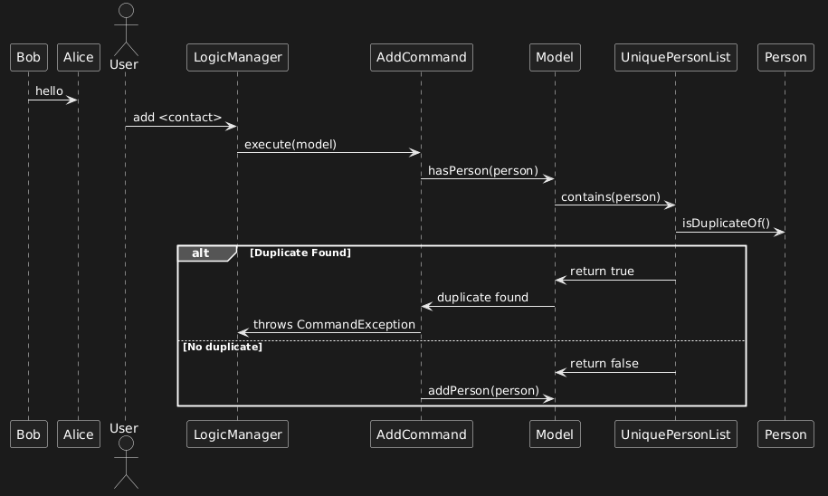
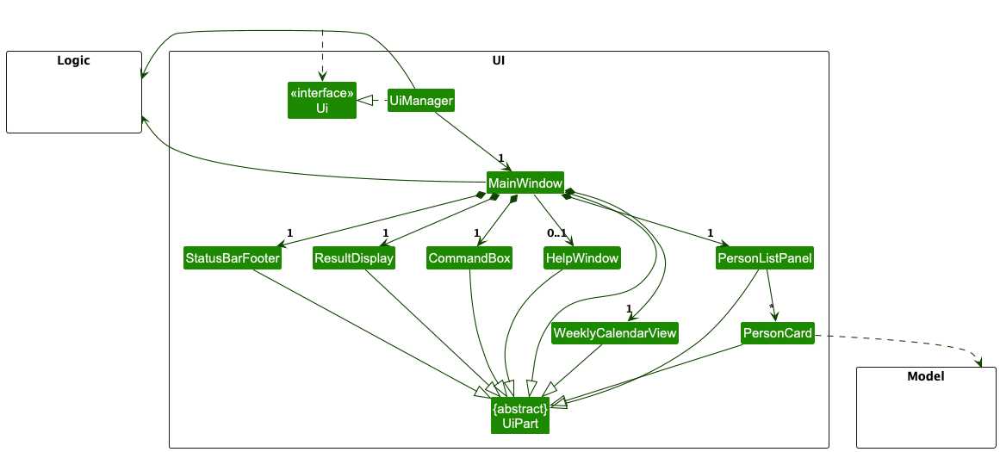
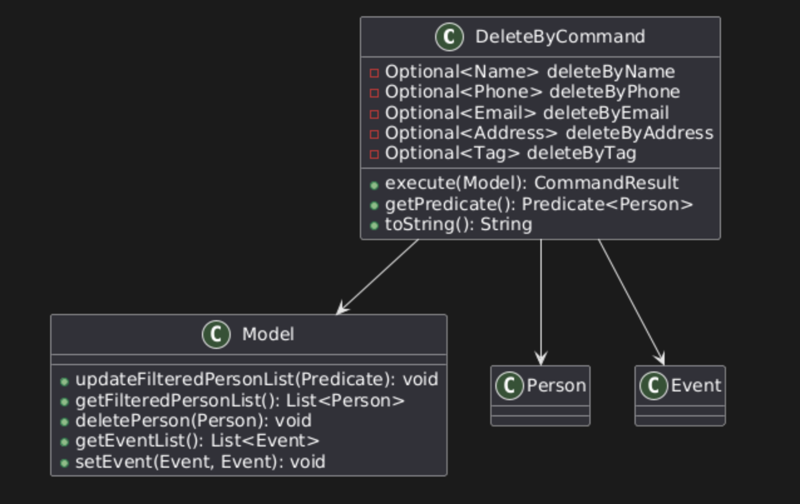
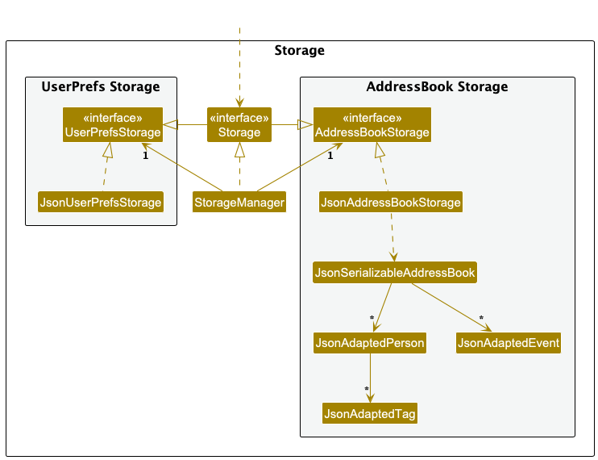

* Table of Contents
{:toc}

---

## **Acknowledgements**

- This project is based on the [se-education's **AddressBook-Level3 (AB3)**](https://github.com/se-edu/addressbook-level3), with extensive enhancements and feature additions.
- [**ChatGPT**](https://openai.com/index/chatgpt/) was used as a development assistant during the project for code review, debugging help, and architectural suggestions, but not for writing or generating entire features.
- The following third-party libraries/tools were reused or integrated into the project:
  - The **[Shadow](https://github.com/GradleUp/shadow)** plugin was reused to generate fat JARs for deployment.
  - The **[Checkstyle](https://docs.gradle.org/current/userguide/checkstyle_plugin.html)** plugin was reused with a custom configuration to enforce consistent code style.
  - The **[JaCoCo](https://docs.gradle.org/current/userguide/jacoco_plugin.html)** plugin was reused from public examples to generate code coverage reports.
  - The **[JUnit 5 (JUnit Jupiter)](https://junit.org/junit5/)** testing framework was reused for unit and integration tests.
  - The **[Mockito](https://site.mockito.org/)** testing library was reused for writing mock-based unit tests, particularly for logic and command tests.
  - The **[Jackson](https://github.com/FasterXML/jackson)** library was reused for JSON (de)serialisation of events, contacts, and application data.
  - The [OpenJFX (JavaFX)](https://openjfx.io/) library was reused for building the GUI. Components like ListView, VBox, and FXML were adapted with custom designs.

---

## **Setting up, getting started**

Refer to the guide [_Setting up and getting started_](SettingUp.md).

---

## **Design**

:bulb: **Tip:** The `.puml` files used to create diagrams in this document `docs/diagrams` folder. Refer to the [_PlantUML Tutorial_ at se-edu/guides](https://se-education.org/guides/tutorials/plantUml.html) to learn how to create and edit diagrams.

### AddCommand Sequence Diagram

The following sequence diagram illustrates the process of adding a contact and how duplicate checking is performed:

### DeleteByCommand Sequence Diagram

The following diagram illustrates how the `deleteby` command is parsed and executed.

### Architecture

The ***Architecture Diagram*** given above explains the high-level design of TrackUp.

Given below is a quick overview of main components and how they interact.

**Main components of the architecture:**
- **`Main`** (consisting of [`Main`](src/main/java/trackup/Main.java) and [`MainApp`](src/main/java/trackup/MainApp.java)) handles launching and shutting down the app.
- The app's core functionality is divided into:
    - [**`UI`**](#ui-component): Handles the user interface.
    - [**`Logic`**](#logic-component): Executes commands.
    - [**`Model`**](#model-component): Manages in-memory data.
    - [**`Storage`**](#storage-component): Reads and writes data to disk.
- [**`Commons`**](#common-classes) contains utility classes shared across components.

## **How Components Interact**
Below is a *Sequence Diagram* showing how TrackUp processes the command `delete 1`:

Each component:
- Defines its API through an `interface`.
- Implements functionality in `{Component Name}Manager` classes.

For example, `Logic` defines its API in `Logic.java` and implements it in `LogicManager.java`.

---

## **Component Breakdown**

### UI component

The **API** of this component is specified in [`Ui.java`](https://github.com/AY2425S2-CS2103T-F14-4/tp/blob/master/src/main/java/trackup/ui/Ui.java)

The UI consists of a `MainWindow` that is made up of parts e.g.`CommandBox`, `ResultDisplay`, `PersonListPanel`, `StatusBarFooter` etc. All these, including the `MainWindow`, inherit from the abstract `UiPart` class which captures the commonalities between classes that represent parts of the visible GUI.

The `UI` component uses the JavaFx UI framework. The layout of these UI parts are defined in matching `.fxml` files that are in the `src/main/resources/view` folder. For example, the layout of the [`MainWindow`](https://github.com/se-edu/addressbook-level3/tree/master/src/main/java/trackup/ui/MainWindow.java) is specified in [`MainWindow.fxml`](https://github.com/se-edu/addressbook-level3/tree/master/src/main/resources/view/MainWindow.fxml)

The `UI` component,
- The `MainWindow` consists of several UI parts (e.g., `CommandBox`, `ResultDisplay`, `ContactListPanel`).
- Uses JavaFX, with UI layouts defined in `src/main/resources/view/*.fxml`.
- Interacts with:
    - **Logic** to execute commands.
    - **Model** to display data.

### Logic component

**API** : [`Logic.java`](https://github.com/se-edu/addressbook-level3/tree/master/src/main/java/trackup/logic/Logic.java)

Here's a (partial) class diagram of the `Logic` component:

The sequence diagram below illustrates the interactions within the `Logic` component, taking `execute("delete 1")` API call as an example.

:information_source: **Note:** The lifeline for `DeleteCommandParser` should end at the destroy marker (X) but due to a limitation of PlantUML, the lifeline continues till the end of diagram.

💡 **How it works:**
1. A user enters a command.
2. `AddressBookParser` determines the appropriate `XYZCommandParser` (e.g., `DeleteCommandParser`).
3. This creates a corresponding `XYZCommand` (e.g., `DeleteCommand`), executed by `LogicManager`.
4. The command modifies `Model` and returns a `CommandResult`.

Here are the other classes in `Logic` (omitted from the class diagram above) that are used for parsing a user command:

How the parsing works:
* When called upon to parse a user command, the `AddressBookParser` class creates an `XYZCommandParser` (`XYZ` is a placeholder for the specific command name e.g., `AddCommandParser`) which uses the other classes shown above to parse the user command and create a `XYZCommand` object (e.g., `AddCommand`) which the `AddressBookParser` returns back as a `Command` object.
* All `XYZCommandParser` classes (e.g., `AddCommandParser`, `DeleteCommandParser`, ...) inherit from the `Parser` interface so that they can be treated similarly where possible e.g, during testing.

### `AddCommandParser` Logic Enhancement
- The `AddCommandParser` validates required fields (name, phone, email, address) individually
  and throws descriptive error messages for each missing attribute.
- This improves user feedback and avoids a generic format error.

### DeleteByCommand Logic
- The `DeleteByCommand` performs exact matching across multiple attributes.
- If no attributes are provided, an error is thrown.
- If multiple contacts match the criteria, a warning message is shown.
- If one match is found, the contact is deleted.

### Model component
**API** : [`Model.java`](https://github.com/se-edu/addressbook-level3/tree/master/src/main/java/trackup/model/Model.java)

The `Model` component,

- Stores all TrackUp data, including:
  - Person objects contained within a UniquePersonList
  - Event objects contained within a UniqueEventList
- Maintains a filtered list of currently displayed Person objects and Event objects.
  - The filtered person list supports searching, listing by category, and sorting by multiple fields.
  - These lists are exposed as unmodifiable ObservableLists, allowing the UI to update automatically when data changes.
- Holds a UserPref object that represents the user's preferences. This is exposed externally as a ReadOnlyUserPref object.
- Operates independently of the other three components. As the Model represents domain entities, it is designed to make sense on its own without depending on other components.

:information_source: **Note:** An alternative (arguably, a more OOP) model is given below. It has a `Tag` list in the `AddressBook`, which `Person` references. This allows `AddressBook` to only require one `Tag` object per unique tag, instead of each `Person` needing their own `Tag` objects. 

### Class Diagram of DeleteByCommand and Related Model Interactions

The following diagram shows the relationship between `DeleteByCommand` and core model classes.

### Storage component

**API** : [`Storage.java`](https://github.com/AY2425S2-CS2103T-F14-4/tp/blob/master/src/main/java/trackup/storage/Storage.java)

The `Storage` component,
- Handles saving and loading both TrackUp data and user preferences in JSON format.
- Inherits from both AddressBookStorage and UserPrefStorage, allowing it to act as either depending on the functionality required.
- Depends on some classes from the Model component, as its role is to store and retrieve objects that belong to the Model.

### Common classes

Classes used by multiple components are in the `trackup.commons` package.

---

## **Implementation**

This section describes some noteworthy details on how certain features are implemented.

## **Implementation Details**

### **Undo/Redo Feature (Proposed)**

- Implemented in `VersionedTrackUp`, extending `TrackUp`.
- Stores history as an `addressBookStateList` with a `currentStatePointer`.
- Supports:
    - `commit()` - Saves current state.
    - `undo()` - Restores previous state.
    - `redo()` - Reapplies undone state.

Workflow:

1. User executes `delete 5`, committing a new state.
2. Executes `add n/David …​`, committing another state.
3. Uses `undo`, restoring the previous state.
4. Uses `redo`, reapplying the undone state.

Given below is an example usage scenario and how the undo/redo mechanism behaves at each step.

Step 1. The user launches the application for the first time. The `VersionedAddressBook` will be initialized with the initial address book state, and the `currentStatePointer` pointing to that single address book state.

Step 2. The user executes `delete 5` command to delete the 5th person in the address book. The `delete` command calls `Model#commitAddressBook()`, causing the modified state of the address book after the `delete 5` command executes to be saved in the `addressBookStateList`, and the `currentStatePointer` is shifted to the newly inserted address book state.

Step 3. The user executes `add n/David …​` to add a new person. The `add` command also calls `Model#commitAddressBook()`, causing another modified address book state to be saved into the `addressBookStateList`.

:information_source: **Note:** If a command fails its execution, it will not call `Model#commitAddressBook()`, so the address book state will not be saved into the `addressBookStateList`.

Step 4. The user now decides that adding the person was a mistake, and decides to undo that action by executing the `undo` command. The `undo` command will call `Model#undoAddressBook()`, which will shift the `currentStatePointer` once to the left, pointing it to the previous address book state, and restores the address book to that state.

:information_source: **Note:** If the `currentStatePointer` is at index 0, pointing to the initial AddressBook state, then there are no previous AddressBook states to restore. The `undo` command uses `Model#canUndoAddressBook()` to check if this is the case. If so, it will return an error to the user rather
than attempting to perform the undo.

The following sequence diagram shows how an undo operation goes through the `Logic` component:

:information_source: **Note:** The lifeline for `UndoCommand` should end at the destroy marker (X) but due to a limitation of PlantUML, the lifeline reaches the end of diagram.

Similarly, how an undo operation goes through the `Model` component is shown below:

The `redo` command does the opposite — it calls `Model#redoAddressBook()`, which shifts the `currentStatePointer` once to the right, pointing to the previously undone state, and restores the address book to that state.

:information_source: **Note:** If the `currentStatePointer` is at index `addressBookStateList.size() - 1`, pointing to the latest address book state, then there are no undone AddressBook states to restore. The `redo` command uses `Model#canRedoAddressBook()` to check if this is the case. If so, it will return an error to the user rather than attempting to perform the redo.

Step 5. The user then decides to execute the command `list`. Commands that do not modify the address book, such as `list`, will usually not call `Model#commitAddressBook()`, `Model#undoAddressBook()` or `Model#redoAddressBook()`. Thus, the `addressBookStateList` remains unchanged.

Step 6. The user executes `clear`, which calls `Model#commitAddressBook()`. Since the `currentStatePointer` is not pointing at the end of the `addressBookStateList`, all address book states after the `currentStatePointer` will be purged. Reason: It no longer makes sense to redo the `add n/David …​` command. This is the behavior that most modern desktop applications follow.

The following activity diagram summarizes what happens when a user executes a new command:

#### Design considerations:

**Aspect: How undo & redo operations are handled:**

* **Alternative 1 (current implementation):** Store snapshots of the entire address book state.
    * Pros: Straightforward and simple to implement.
    * Cons: Potential memory inefficiency due to storing large states repeatedly.

* **Alternative 2:** Each individual command maintains its own undo/redo logic.
    * Pros: More memory-efficient (for example, `delete` only stores the deleted contact).
    * Cons: Increases complexity — every command must correctly implement and manage undo/redo behavior.

### \[Proposed\] Data archiving

- We propose implementing data archiving by allowing the user to archive inactive contacts. Archived contacts
will not appear in the active contact list but will be stored separately for retrieval. The archived
data will be saved in a designated JSON file, archive.json, and displayed upon user request via an archive command.

---

## **Instructions for Manual Testing**

Below are guidelines for performing manual testing of the app.

:information_source: **Note:** These instructions only provide a starting point for testers to work on;
testers are expected to do more *exploratory* testing.

### Launch and shutdown

1. **Initial launch**
    1. Download the JAR file and place it in an empty folder.
    2. Double-click the JAR file.
       **Expected:** The GUI launches with a set of sample contacts displayed. The initial window size may not be optimal.

2. **Saving window preferences**
    1. Resize the window to an optimal size and move it to a preferred location. Close the window.
    2. Re-launch the app by double-clicking the JAR file.
       **Expected:** The most recent window size and position are retained.

### Deleting a contact

1. **Deleting a contact while all contacts are shown**
    1. **Prerequisites:** List all contacts using the `list` command. Ensure multiple contacts are visible.
    2. Test case: `delete 1`  
       **Expected:** The first contact is deleted from the list. The status message displays the details of the deleted contact. The timestamp in the status bar updates.
    3. Test case: `delete 0`  
       **Expected:** No contact is deleted. The status message displays an error message. The status bar remains unchanged.
    4. Other invalid delete commands to test: `delete`, `delete x`, `...` (where `x` exceeds the list size)
       **Expected:** Similar error messages appear, and no contact is deleted.

### Deleting a contact by attributes

1. **Deleting a person using unique attribute**
    1. **Prerequisites:** Add a contact with a unique name using `add -n John Doe -p 98765432 -e johnd@example.com -a 123 Street`.
    2. Test case: `deleteby -n John Doe`  
       **Expected:** John Doe is deleted. A confirmation message appears.
2. **Deleting with non-unique match**
    1. Add two persons with the same category: `Client`.
    2. Test case: `deleteby -c Client`  
       **Expected:** No deletion occurs. An error message about multiple matches is shown.
3. **Invalid command**
    1. Test case: `deleteby`  
       **Expected:** Error shown for missing required attributes.

### Editing a person

1. **Editing a contact's email and phone**
    1. **Prerequisites:** Add a contact using `add`.
    2. Test case: `edit 1 -p 91234567 -e new@example.com`  
       **Expected:** Contact at index 1 is updated with new phone and email.
2. **Removing all tags**
    1. Test case: `edit 1 -t`  
       **Expected:** All tags from contact at index 1 are removed.
3. **Invalid index or no fields provided**
    1. Test case: `edit 0, edit 1`  
       **Expected:** Error about invalid index or missing fields.

### Listing all persons

1. **Listing all contacts**
    1. Test case: `list`  
       **Expected:** All contacts are displayed.
2. **Listing by category**
    1. Test case: `list Client`  
       **Expected:** Only contacts categorized as `Client` are shown.
3. **Invalid input**
    1. Test case: `list UnknownCategory`  
       **Expected:** No contacts shown. Possibly empty list.

### Sorting persons list

1. **Sort by name ascending**
    1. Test case: `sort -n true`  
       **Expected:** Contacts sorted alphabetically by name.
2. **Sort by multiple fields**
    1. Test case: `sort -t true -n false`  
       **Expected:** Sorted by tag ascending, then name descending.
3. **No attributes provided**
    1. Test case: `sort`  
       **Expected:** List is displayed without sorting.

### Searching for a person

1. **Search by partial name**
    1. Test case: `search John`  
       **Expected:** Contacts with "John" in any field are listed.
2. **Search by phone**
    1. Test case: `search 9876`  
       **Expected:** Contacts whose phone numbers contain 9876 are shown.
3. **No match**
    1. Test case: `search qwerty`  
       **Expected:** Empty result list with status message.

### Adding an event

1. **Add event without contacts**
    1. Test case: `addevent -t Demo -s 2025-04-01 10:00 -e 2025-04-01 11:00`  
       **Expected:** Event is added and appears in the calendar view.
2. **Add event linked to contacts**
    1. Test case: `addevent -t Sync -s 2025-04-01 14:00 -e 2025-04-01 15:00 -c 1 -c 2`  
       **Expected:** Event is created and linked to specified contacts.
3. **Invalid datetime**
    1. Test case: `addevent -t Invalid -s 2025-04-01 -e 2025-04-01`  
       **Expected:** Error for invalid date format.

### Deleting an event

1. **Delete by title keyword**
    1. Test case: `delevent -t Demo`  
       **Expected:** Events with "Demo" in the title are deleted.
2. **Delete by exact datetime**
    1. Test case: `delevent -s 2025-04-01 10:00 -e 2025-04-01 11:00`  
       **Expected:** Events matching this time range are removed.
3. **No filters**
    1. Test case: `delevent`  
       **Expected:** Error due to missing required filters.

### Adding a note to a person

1. **Add a valid note**
    1. Test case: `addnote 1 Met at pitch event`  
       **Expected:** Note is shown under the contact’s details.
2. **Add note exceeding limit**
    1. Add 5 notes to a contact.
    2. Test case: `addnote 1 Sixth note`  
       **Expected:** Error about maximum number of notes.
3. **Note too long**
    1. Test case: `addnote 1 This note exceeds fifty characters in total.`  
       **Expected:** Error about note length.

### Deleting a note from a person

1. **Delete valid note**
    1. Test case: `delnote 1 1`  
       **Expected:** First note from the contact is removed.
2. **Invalid note index**
    1. Test case: `delnote 1 10`  
       **Expected:** Error for invalid note index.
3. **Invalid person index**
    1. Test case: `delnote 0 1`  
       **Expected:** Error for invalid person index.

### Toggling field visibility

1. **Hide field**
    1. Test case: `toggle phone`  
       **Expected:** Phone field disappears from contact list UI.
2. **Show previously hidden field**
    1. Execute `toggle phone` again.  
       **Expected:** Phone field reappears.
3. **Invalid field name**
    1. Test case: `toggle shoesize`  
       **Expected:** Error for unsupported field.

### Saving data

1. **Handling missing or corrupted data files**

    1. Delete or rename the `data/trackup.json` file while the application is closed.
        - **Expected:** When the app is launched again, it should recreate the file with default content without crashing.

    2. Modify the JSON file and introduce an invalid value (e.g., change a phone number to `"abc"`).
        - **Expected:** Upon startup, TrackUp will show an error dialog indicating corrupted data and load with an empty state.

    3. Save a contact or event and then restart the app.
        - **Expected:** The newly added data should persist across restarts.

---

## **Planned Enhancements**

Team size: 4

1. **Smart Contact Deletion Warnings**
    - *Current*: The app deletes a contact immediately when the delete or deleteby command is used, without checking relationships.
    - *Planned*: If a contact is linked to an event or mentioned in a note (e.g., "Amy Lee is lead for this meeting"), the app prompts the user for confirmation:
      `This contact is referenced in one or more events or notes. Are you sure you want to delete Amy Lee? (y/n)`
    - *Reason*: Prevents accidental loss of linked data and improves user awareness of contact associations.

2. **Edit Command Input Validation Enhancements**
    - *Current*: Accepts input with missing fields without clear feedback.
    - *Planned*: Explicitly alert users when all fields are missing in an edit command.
      For example: `No fields provided. Please specify at least one field to edit.`
    - *Reason* : Reduces user confusion and enforces proper command usage.

3. **Auto-Restore Contact List After Empty Search/Find**
   - *Current*: When the search or find command returns no matching persons, the UI shows an empty contact list. To view contacts again, users must manually run the list command. 
   - *Planned*: Automatically display a message such as `No matching persons found. Showing all contacts again.`
   and immediately restore the full contact list in the UI. 
   - *Reason*: Saves users from having to re-run the list command and improves flow when navigating back after a failed search.

4. **Accurate Feedback for Empty List Command with Category Results**
    - *Current*: When the list command is used with a category (e.g., list Other) and no contacts exist in that category, the app still displays the message: `Listed all persons in category: [Other]` even though the resulting list is empty.
    - *Planned*: Detect when no contacts are found and display a clearer message such as: `No contacts found in category: [Other]` to distinguish it from a successful filtered listing.
    - *Reason*: Prevents confusion and helps users understand that the category exists but currently has no matching contacts.

5. **Undo Support for Destructive Commands**
    - *Current*: Commands like clear, delete, delevent, or delnote cannot be reversed. 
    - *Planned*: Introduce a basic undo feature that allows reverting the most recent destructive command. 
    - *Reason*: Offers a safety net for mistakes and enhances user trust.

---

## **Documentation, logging, testing, configuration, dev-ops**

* [Documentation guide](Documentation.md)
* [Testing guide](Testing.md)
* [Logging guide](Logging.md)
* [Configuration guide](Configuration.md)
* [DevOps guide](DevOps.md)

---

## **Appendix: Requirements**

### Product scope

**Target user profile**:

- **Startup founders** who
  - Need to manage and keep track of client and investor contacts
  - Regularly track meetings and events with clients and investors
  - Prefer desktop-based applications over web or mobile platforms
  - Type quickly and favor CLI-based interactions over GUI navigation
  - Are reasonably comfortable working with CLI-based tools

**Value proposition**: A fast, secure, and offline-first contact management tool designed for startup founders to consolidate contacts and event information in one place. It streamlines workflows, aids better decision-making, and enhances productivity with features for logging communication, scheduling meetings, and reviewing notes — accessible in-office or on the go.

### User stories

| Priority | As a                | I can...                                                   | So that I can                                                     |
|----------|---------------------|------------------------------------------------------------|-------------------------------------------------------------------|
| * * *    | Potential user      | view the system with pre-populated placeholder data        | understand how it works before committing fully                   |
| * * *    | Potential user      | receive guided prompts                                     | easily grasp the tool’s key features                              |
| * * *    | Potential user      | interact with a chatbot for any queries                    | clarify doubts before deciding to use the tool                    |
| * * *    | Potential user      | browse through a feature overview                          | understand the tool’s core functionalities                        |
| * * *    | Potential user      | read a clear and concise value proposition                | learn how the tool benefits my business                           |
| * * *    | New user            | follow a "Getting Started" checklist                       | complete the setup quickly and efficiently                        |
| * * *    | New user            | import existing contacts                                   | avoid manually entering all contacts                              |
| * * *    | New user            | go through a tutorial mode                                 | understand the basics in no time                                  |
| * * *    | New user            | access an in-app help center or FAQs                       | find answers without leaving the tool                             |
| * * *    | New user            | reset my data if I make mistakes during setup              | start fresh when needed                                           |
| * * *    | New user            | explore example use cases                                  | learn how others are using the tool                               |
| * * *    | 2nd time user       | categorize contacts into clients, investors, and partners  | manage them separately and more effectively                       |
| * * *    | 2nd time user       | filter contacts by tags                                    | quickly find the contacts I need                                  |
| * * *    | 2nd time user       | add and edit client details                                | keep my contact information up to date                            |
| * *      | 2nd time user       | attach notes to contacts                                   | keep additional important details recorded                        |
| * *      | 2nd time user       | customize fields for contact information                   | store only business-relevant data                                 |
| * *      | 10th time user      | mark high-priority contacts                                | easily identify my most important clients                         |
| * *      | 10th time user      | merge duplicated contacts                                  | keep my contact list clean and organized                          |
| * *      | 10th time user      | archive inactive contacts                                  | ensure my contacts remain relevant                                |
| * * *    | 10th time user      | log interactions (calls, emails, meetings) with contacts   | track communication history effectively                           |
| * * *    | 10th time user      | set follow-up reminders after interactions                 | ensure I never miss important follow-ups                          |
| * * *    | 10th time user      | search interaction records by keyword                      | easily locate past conversations                                  |
| * *      | 10th time user      | tag interactions with custom labels                        | organize and filter them as needed                                |
| * * *    | 10th time user      | set reminders for events                                   | never miss key meetings                                           |
| * * *    | 10th time user      | receive reminders for pending tasks related to contacts    | stay on top of my to-do list                                      |
| *        | 10th time user      | categorize contacts by industry or company size            | tailor communication styles based on business type                |
| *        | 100th time user     | generate reports on client interactions                    | analyze engagement trends                                         |
| *        | 100th time user     | track conversion rates from leads to clients               | measure my business’s growth                                      |
| *        | 100th time user     | receive automated insights on neglected contacts           | re-engage those contacts                                         |
| * *      | 100th time user     | create customizable dashboards                             | focus on the metrics that matter to me                            |
| *        | 100th time user     | use shortcuts for frequently performed tasks               | work more efficiently                                             |
| *        | 100th time user     | batch process multiple contacts                            | save time on repetitive actions                                   |
| *        | 100th time user     | automate follow-ups                                        | keep client engagement streamlined                                |
| * *      | 100th time user     | export my contacts, events, and interaction history        | share or back up important data                                   |
| * *      | 100th time user     | receive reminders for important client anniversaries       | strengthen client relationships with personalized attention       |

## **Use Cases**

*(For all use cases below, the **System** is `TrackUp`, and the **Actor** is the `User`, unless specified otherwise.)*

---

### Use Case: Add a Tag to a Contact

#### Main Success Scenario (MSS)
1. User requests to list contacts.
2. TrackUp displays a list of contacts.
3. User requests to add a tag to a specific contact in the list.
4. TrackUp adds the tag to the contact and displays a confirmation message.

   Use case ends.

#### Extensions
- 2a. The contact list is empty.
    - 2a1. TrackUp shows: `"No contacts found."`
    - Use case ends.

- 3a. The specified contact index is invalid.
    - 3a1. TrackUp shows an error message: `"Invalid contact index. Please enter a valid number."`
    - Use case resumes at step 2.

- 3b. The tag already exists.
    - 3b1. TrackUp shows a message: `"This tag is already assigned to the contact."`
    - Use case resumes at step 2.

---

### Use Case: View All Contacts

#### Main Success Scenario (MSS)
1. User requests to view all contacts.
2. TrackUp displays all contacts.
   Use case ends.

#### Extensions
- 2a. The contact list is empty.
    - Use case ends.

---

### Use Case: View Contacts with Client Category

#### Main Success Scenario (MSS)
1. User requests to view contacts with the category `Client`.
2. TrackUp displays only the contacts categorised as `Client`.
   Use case ends.

#### Extensions
- 2a. The contact list under the `Client` category is empty.
    - Use case ends.

---

### Use Case: Edit a Contact

#### Main Success Scenario (MSS)
1. User requests to list all contacts.
2. TrackUp displays the list of contacts.
3. User requests to edit a specific contact in the list, specifying the new details.
4. TrackUp updates the contact's details.
5. TrackUp displays a confirmation message.
   Use case ends.

#### Extensions
- 2a. The contact list is empty.
    - 2a1. TrackUp shows a message: `"No contacts found."`
    - Use case ends.

- 3a. The specified contact index is invalid.
    - 3a1. TrackUp shows an error message: `"Invalid contact index. Please enter a valid number."`
    - Use case resumes at step 2.

- 3b. The new details are the same as the existing details.
    - 3b1. TrackUp shows a message: `"No changes detected. Contact remains unchanged."`
    - Use case ends.

- 3c. The new details contain invalid inputs (e.g., incorrect phone format, missing required fields).
    - 3c1. TrackUp shows an error message specifying the issue.
    - Use case resumes at step 2.

---

### Use Case: Delete a Contact

#### Main Success Scenario (MSS)
1. User requests to list contacts.
2. TrackUp displays a list of contacts.
3. User requests to delete a specific contact in the list.
4. TrackUp deletes the contact and displays a confirmation message.
   Use case ends.

#### Extensions
- 2a. The contact list is empty.
    - 2a1. TrackUp shows: `"No contacts found."`
    - Use case ends.

- 3a. The given index is invalid.
    - 3a1. TrackUp shows an error message: `"Invalid contact index. Please enter a valid number."`
    - Use case resumes at step 2.

- 3c. The contact is referenced by an event or another entity.
    - 3c1. TrackUp shows: `"The contact Amy Lee could not be deleted as it is referenced by event: Pitch Call."`
    - Use case ends.

---

### Use Case: Add an Event

#### Main Success Scenario (MSS)
1. User requests to add an event.
2. TrackUp creates the event and links the specified contacts.
3. TrackUp updates the weekly calendar view to display the new event.
4. TrackUp displays a confirmation message.
Use case ends.

#### Extensions
- 1a. The start datetime is after the end datetime.
  - 1a1. TrackUp shows an error message: `"End datetime provided is before start datetime"`
  - Use case resumes at step 1.

- 1b. One or more specified contact indices are invalid.
  - 1b1. TrackUp shows an error message: `"The person index provided is invalid"`
  - Use case resumes at step 1.

---

### Use Case: Delete an Event

#### Main Success Scenario (MSS)
1. User requests to delete an event.
2. TrackUp finds all matching events.
3. TrackUp deletes all occurrences of the matching events.
4. TrackUp updates the weekly calendar view to remove the deleted events.
5. TrackUp displays a confirmation message.
Use case ends.

#### Extensions
- 2a. No matching events are found.
  - 2a1. TrackUp shows a message: `"No matching events found."`
  - Use case ends.

### Non-Functional Requirements

**Data Requirements**
1. Persistency: All user data, including contacts, events, and notes, must be stored locally in a human-editable text file.
2. Data Size: The application should efficiently handle up to 10,000 contacts and 50,000 event entries without noticeable performance degradation.
3. Data Volatility: Changes to data should be saved immediately upon execution of commands to prevent data loss.

**Environment Requirements**
1. Platform Independence: The application should run on Windows, macOS, and Linux without requiring platform-specific modifications.
2. Java Compatibility: The application must be compatible with Java 17 and should not require any additional dependencies beyond those included in the JAR package.
3. Portability: The application should function without an installation process and be packaged as a single executable JAR file.
4. Resolution Compatibility: The GUI (if present) should work seamlessly at 1920x1080 and 125% scaling and remain usable at 1280x720 and 150% scaling.

**Accessibility & Usability**
1. Typing-Optimised: The application must prioritise CLI-based input to cater to users who type fast, allowing all actions to be performed through text commands.
2. Minimal GUI Elements: If a GUI is implemented, it should primarily provide visual feedback rather than serve as the primary input method.
3. Learnability: The application should provide a quick-start tutorial that allows new users to become proficient within 10 minutes.

**Performance Requirements**
1. Response Time: Commands should execute within 500ms under normal operation (10,000 contacts, 50,000 event entries).
2. Memory Usage: The application should not exceed 200MB of RAM usage during peak operations.
3. Startup Time: The application should launch and be ready for use within 2 seconds on a modern system (Intel i5 8th Gen, 8GB RAM, SSD).

**Security & Privacy**
1. Data Confidentiality: User data must remain local and should not be transmitted over the internet.
2. No External Storage: The application should not rely on remote servers for storage or functionality.
3. User Control: Users should have complete control over their data, with the ability to edit, back up, and delete it manually.

**Maintainability & Extensibility**
1. Modular Codebase: The system should follow Object-Oriented Programming principles to facilitate maintainability.
2. Incremental Development: Features should be added in small, working increments to ensure continuous functionality.
3. Extensibility: New features should be implementable without breaking existing functionality, following Open/Closed Principle (OCP).

**Reliability & Fault Tolerance**
1. Error Handling: The application should provide meaningful error messages for invalid user input.
2. Fault Recovery: The application should automatically recover from crashes by restoring the last saved state.
3. Data Integrity: Data should not be corrupted even in the event of an unexpected shutdown.
4. Informative Deletion Errors: When deletion fails due to dependencies (e.g., linked events), the app should indicate which contact or event is causing the block.

**Testability**
1. Automated Testing: The application should support unit and integration testing to ensure correctness.
2. Manual Testing Feasibility: The application should be testable by peer testers without requiring complex setups.
3. Regression Prevention: Existing functionalities should remain functional after new feature additions.

**Scalability & Stability**
1. Scalability: The application should handle an increasing number of contacts and events without performance degradation.
2. Stability: The application should function without crashes or major bugs under normal operating conditions.

*{More to be added}*

### Glossary

**Glossary**

* **Command** A textual input used to execute a specific function within the application.
* **Mainstream OS** Operating systems commonly used, such as Windows, Linux, Unix, and macOS.
* **Contact** A contact entry that usually contains a name, phone number, email address, and mailing address.
* **Event** An occurrence with a starting datetime, ending datetime, description, and optionally an associated contact.
* **Note** Additional information that must be associated with either a contact or an event.
* **Tag** A short phrase that describes a contact.
* **Duplicate Handling** A system mechanism that ensures contacts with identical names, emails, and phone numbers are not duplicated.
* **Error Message** A notification displayed when an invalid input or operation is attempted.
* **Indexing** A numerical representation of items in a list to help users select a specific entry.
* **Parameter** A required or optional input that modifies the behavior of a command.
* **Pagination** A method of displaying large lists in smaller, more manageable sections.
* **Sorting** Arranging displayed contacts in a specified order, such as alphabetically.

---
